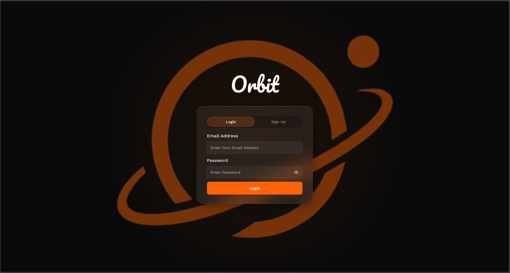
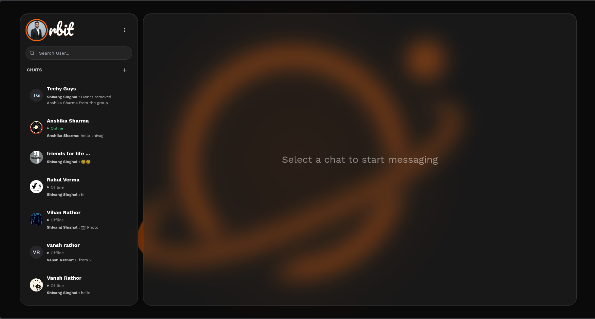
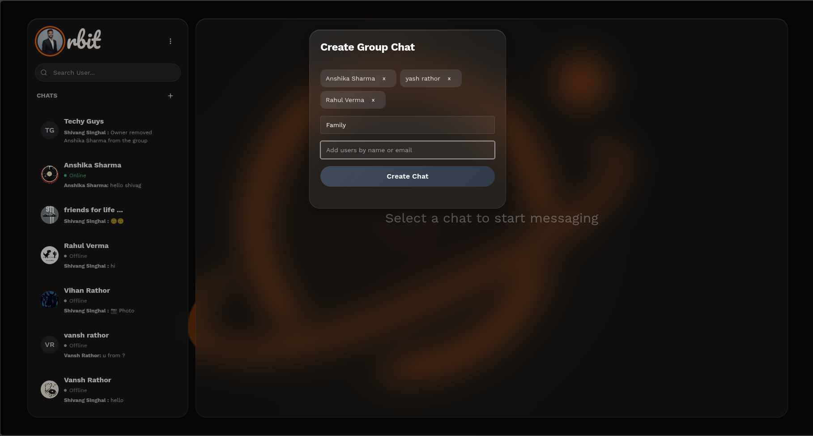
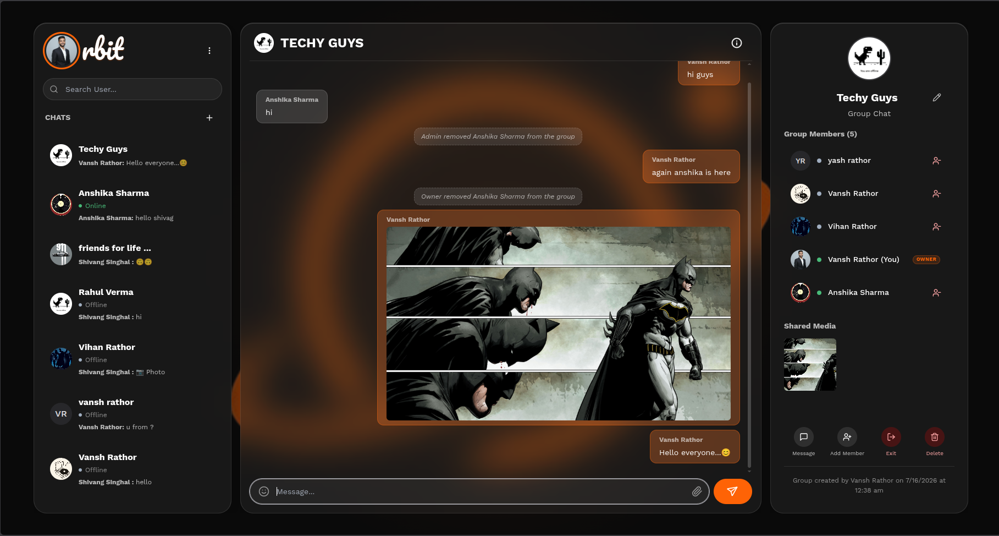
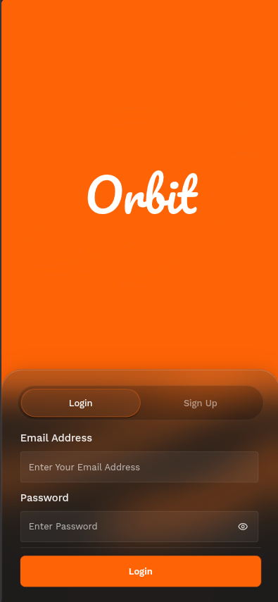
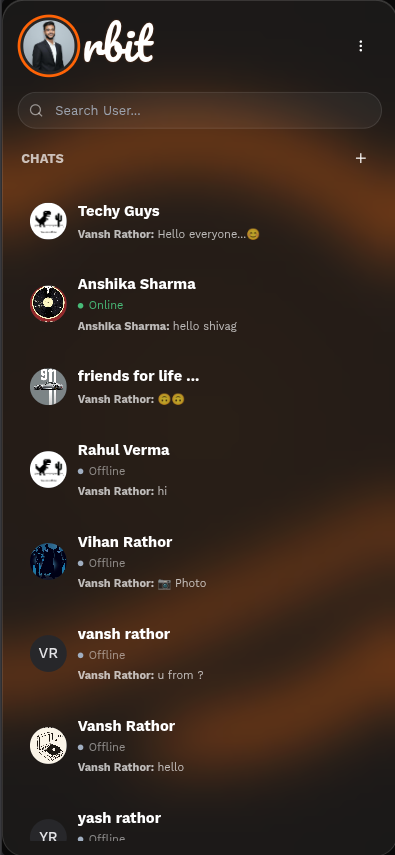
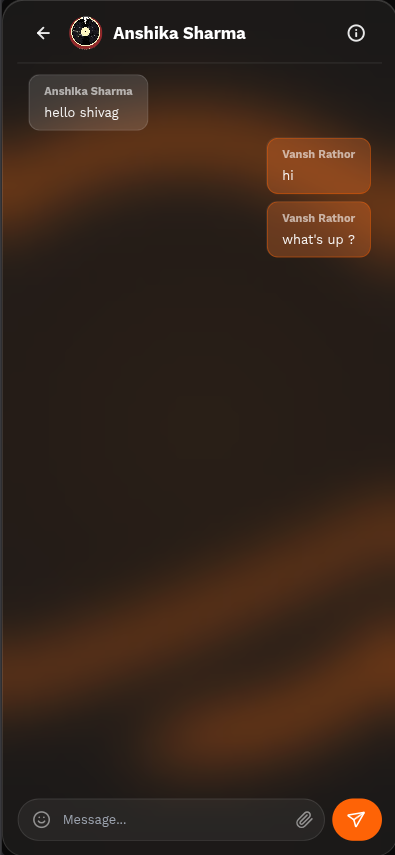

<div align="center">


# Orbit

### A premium, real-time glassmorphic chat application

*Fast. Fluid. Feature-rich.*

[](https://nodejs.org/)
[](https://react.dev/)
[](https://www.mongodb.com/)
[](https://socket.io/)
[](https://chakra-ui.com/)
[](https://cloudinary.com/)

[Live Demo](#) · [Report Bug](#) · [Request Feature](#)

</div>

---

## 📖 About

**Orbit** is a real-time messaging platform built on the MERN stack with a modern glassmorphic UI. It supports one-on-one and group conversations, live presence tracking, typing indicators, and Cloudinary-backed media sharing — all synchronized instantly via WebSockets.

---

## 📸 Screenshots

Orbit ships dedicated layouts for desktop and mobile. Expand a section below to preview.

<details>
<summary><strong>🖥️ Desktop View</strong></summary>
<br>

| Login | Chat Dashboard |
|---|---|
|  |  |

| Group Chat Modal | Profile Panel |
|---|---|
|  |  |

</details>

<details>
<summary><strong>📱 Mobile View</strong></summary>
<br>

<p>
  
  
  
</p>

</details>


---

## ✨ Features

- **Real-Time Messaging** — messages delivered instantly to active users via WebSockets
- **Group Chat Creation** — custom group name and initial member selection
- **Dynamic Online/Offline Status** — live presence tracking driven by active Socket.IO connections
- **Real-Time Typing Indicators** — "typing..." state shown live in the conversation panel
- **Multimedia Sharing** — direct Cloudinary-hosted image sharing in chats
- **Interactive Emoji Picker** — emoji popover integrated into the message composer
- **Shared Media Gallery** — consolidated grid view of all images exchanged in a chat
- **Custom Wallpapers** — 8 background presets for personalizing the app
- **User Profiles** — name, email, bio, and custom profile picture with update support
- **Group Management** — add members, remove members (owner-only), rename group, change group avatar, leave group, delete group (with cascading Cloudinary asset cleanup)
- **Secure Authentication** — bcryptjs password hashing + JWT-based session auth
- **Debounced Search** — sidebar and modal user search throttled (300ms/500ms) to reduce server load

---

## 🔮 Future Enhancements

- **Message interactions** — editing, deletion, reactions, pins, and replies (currently CRUD is create + retrieve only)
- **Group role promotion** — ability to promote another member to admin (currently only the group creator holds admin rights)
- **Voice messages** — recording and playback support

---

## 🛠️ Tech Stack

**Backend**
| Package | Version |
|---|---|
| Express | ^5.2.1 |
| Socket.IO | ^4.8.3 |
| Mongoose | ^9.7.3 |
| jsonwebtoken | ^9.0.3 |
| bcryptjs | ^3.0.3 |
| cloudinary | ^2.10.0 |
| multer | ^2.2.0 |
| dotenv | ^17.4.2 |
| express-async-handler | ^1.2.0 |

**Frontend**
| Package | Version |
|---|---|
| React / React DOM | ^19.2.7 |
| Chakra UI | ^3.36.0 |
| Tailwind CSS | ^4.3.2 |
| Socket.IO Client | ^4.8.3 |
| Axios | ^1.18.1 |
| emoji-picker-react | ^4.19.1 |
| next-themes | ^0.4.6 |
| react-icons | ^5.7.0 |
| react-router-dom | ^7.18.1 |

---

## 📁 Project Structure

```
├── backend/
│   ├── Models/         # Mongoose Schemas (User, Chat, Message)
│   ├── config/         # Database and JWT utility configurations
│   ├── controller/     # Express route handlers
│   ├── middleware/     # Auth checks and global error handlers
│   ├── routes/         # Express endpoint definitions
│   └── server.js       # Main server entrypoint & Socket.IO events
├── frontend/
│   ├── public/         # Static assets and index.html
│   └── src/
│       ├── Context/    # React Context (ChatProvider, global Socket setup)
│       ├── Pages/      # Main views (Home, ChatPage)
│       ├── components/ # Chat layout, inputs, modals, right details panel
│       ├── config/     # Chat logics and wallpaper settings
│       ├── App.js      # Main component and routers
│       └── index.js    # Entry point
├── package.json
└── README.md
```

---

## ⚙️ Setup Instructions

### Prerequisites
- Node.js (v18+)
- MongoDB connection string
- Cloudinary account (for image sharing and custom avatars)

### Installation

```bash
git clone <repository-url>
cd Orbit

npm install

cd frontend
npm install
cd ..
```

### Environment Configuration

Create a `.env` file in the `backend/` directory (or workspace root):

```env
PORT=3000
MONGO_URI=mongodb+srv://<username>:<password>@cluster.mongodb.net/orbit
JWT_SECRET=your_jwt_signing_key_here
NODE_ENV=development

# Required for cascading delete of group avatars
CLOUDINARY_CLOUD_NAME=your_cloudinary_cloud_name
CLOUDINARY_API_KEY=your_cloudinary_api_key
CLOUDINARY_API_SECRET=your_cloudinary_api_secret
```

> **Note:** The frontend currently uses a hardcoded Cloudinary unsigned upload preset for profile pictures and media messages. To use your own Cloudinary account for uploads, update the preset/cloud name in `Signup.js`, `ProfileModal.js`, `SingleChat.js`, and `RightProfilePanel.js`.

### Running the Application

**Backend** (from project root):
```bash
npm start
```
Runs on `http://localhost:3000` by default.

**Frontend** (in a separate terminal):
```bash
cd frontend
npm start
```
Runs on `http://localhost:5173` (or next available port) and proxies requests to the backend.


---

## 🤝 Contributing

Contributions are welcome! Feel free to open an issue or submit a pull request.

1. Fork the project
2. Create your feature branch (`git checkout -b feature/AmazingFeature`)
3. Commit your changes (`git commit -m 'Add some AmazingFeature'`)
4. Push to the branch (`git push origin feature/AmazingFeature`)
5. Open a Pull Request

---

## 📄 License

Distributed under the MIT License. See `LICENSE` for more information.

---

## 👤 Author

**Vansh Rathor**

- Portfolio: [vanshrathorportfolio.netlify.app](https://vanshrathorportfolio.netlify.app/)
- LinkedIn: [vansh-kumar-20-codes](https://www.linkedin.com/in/vansh-kumar-20-codes/)
- GitHub: [@VanshRathor20](https://github.com/VanshRathor20)

<div align="center">
  <sub>Built with ❤️ using the MERN stack</sub>
</div>
